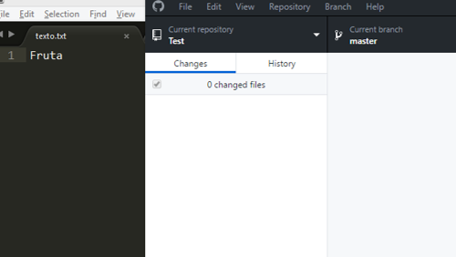
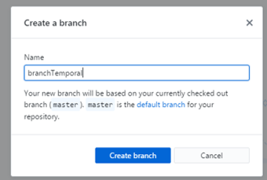
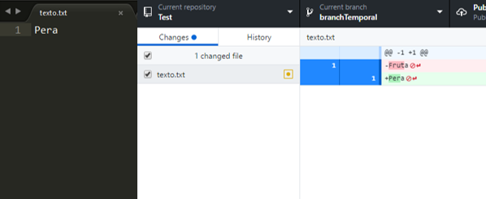
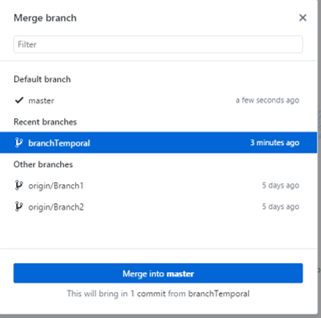
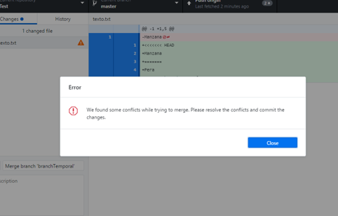
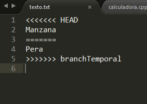

# Conflictos

Un conflicto en Git ocurre cuando dos personas cambian una misma línea en un archivo, o bien una lo borró mientras que la otra hizo modificaciones y después de esto se intenta hacer un “Merge”. Básicamente Git no sabe con cuál de las dos versiones debería quedarse, ya que en ambas versiones se modificó el mismo elemento.

Hagamos un ejemplo para entenderlo mejor: 

---
En este caso tenemos un repositorio llamado *Test*, estamos en el Branch *master* y tenemos dentro del repositorio un archivo de texto que dice la palabra “Fruta”.

Observa lo que pasa si primeramente se crea una Branch que copia este último Commit, en este caso llamada “branchTemporal”. Dentro de este Branch se hace una modificación, se cambia la palabra “Fruta” por “Pera”, y posteriormente se hace un Commit de este cambio.

Nos regresamos a “master”, por lo que en el archivo de texto sigue diciendo “Fruta”, se hace una modificación pero diferente a la que se hizo en “branchTemporal”, se cambia la palabra “Fruta” por “Manzana” y se hace un Commit del cambio.

En este momento el ultimo Commit de “master” y el ultimo commit de “branchTemporal” modificaron la misma línea. Por lo que, si intentásemos hacer un Merge, tendremos un conflicto. Afortunadamente Git nos avisa cuando un conflicto ocurre y nos da la oportunidad de arreglarlo.

Desafortunadamente los conflictos se deben de resolver manualmente, hay que entrar al documento y borrar lo que no deseemos, y así quedarnos con el cambio que realmente queremos que esté.

Posterior a esto se hace un Commit de modo que la resolución del conflicto quede hecha. Después de esto podemos volver a trabajar normalmente. Nota que los conflictos siempre van a ocurrir de manera local, no remota. Además que no solo puede haber conflictos al hacer un Merge, sino también al hacer un *Pull*, trayendo cambios del repositorio remoto.
